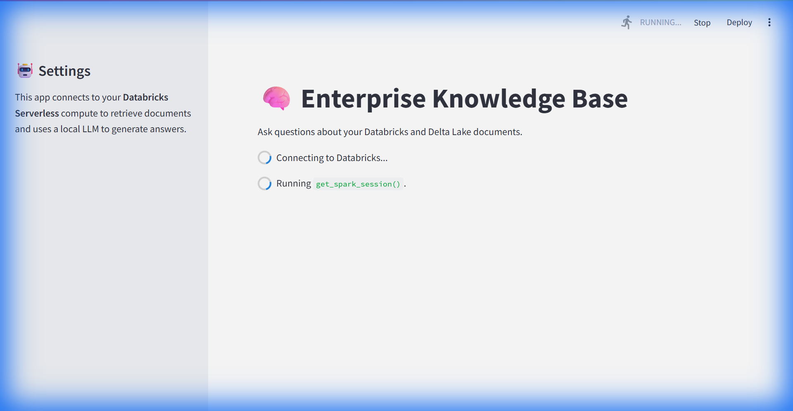
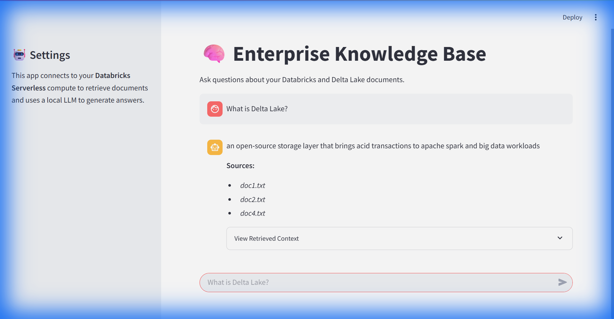
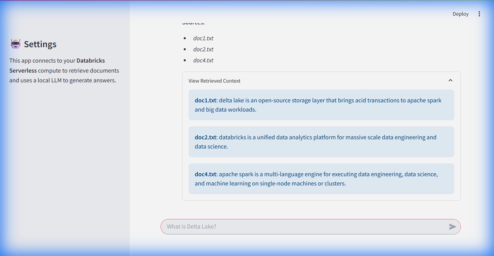

# 📘 Databricks RAG Application User Guide

Welcome to the **Enterprise Knowledge Base**! This application uses Retrieval-Augmented Generation (RAG) to answer questions based on your own documents stored in Databricks Delta Lake.

## 🚀 Getting Started

### Prerequisites
Ensure you have the following installed and configured:
- **Python 3.8+**
- **Databricks Connect** configured with your workspace.
- **Streamlit** (`pip install streamlit`)

### 1. Data Ingestion & Indexing
Before using the app, the data must be ingested and indexed. This is handled by the `run_rag_demo.py` script.

```bash
python run_rag_demo.py
```

This script performs the following:
1.  **Ingests** sample text files into a Delta Table (`raw_documents`).
2.  **Chunks** the text into smaller pieces (`silver_chunks`).
3.  **Generates Embeddings** for each chunk using a pre-trained AI model (`gold_embeddings`).
4.  **Builds a FAISS Index** locally for fast retrieval.

### 2. Launching the Application
To start the user interface, run the following command in your terminal:

```bash
streamlit run streamlit_app.py
```

The application will open in your default web browser (usually at `http://localhost:8501`).

---

## 📖 How to Use the Application

### Step 1: Home Screen
When the app loads, it will automatically connect to your Databricks Serverless compute and load the local AI models. You will see the home screen with a chat interface.



### Step 2: Ask a Question
Type your question into the chat input box at the bottom of the screen. For example:
> *"What is Delta Lake?"*

The agent will search your documents for the most relevant information and generate an answer.



### Step 3: Verify Sources
Transparency is key in AI. You can verify where the answer came from by clicking the **"View Retrieved Context"** expander below the answer. This shows the exact text chunks retrieved from your Delta Lake tables.



---

## 🛠️ Troubleshooting

- **"Index not found!"**: This means the `run_rag_demo.py` script hasn't been run, or the `rag_data` folder was deleted. Run the ingestion script again.
- **"Failed to connect to Databricks"**: Check your `.databrickscfg` file and ensure your cluster/serverless compute is active.
- **Slow Responses**: The first request might take a few seconds to warm up the connection. Subsequent requests should be faster.

---

*Built with ❤️ using Databricks, LangChain, and Streamlit.*
